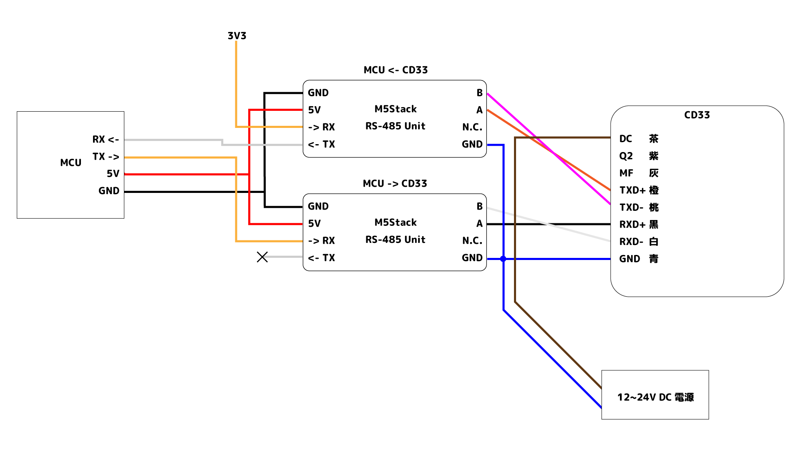

# CD33-PoC

### これはなに

[OPTEX社製CD33レーザー変位センサ](https://www.optex-fa.jp/products/dsp_sensor/cd33/index02.html)と通信するプログラムです．

CD33レーザー変位センサのモデルの一つはRS-422通信でデータが読み取れるようになっており，本リポジトリにはこのセンサとのかんたんな通信プログラムが含まれています．

### センサ仕様(CD33-120N-422)

* 毎秒約1000回，30μmくらいの変化を捉えることができる変位センサ
* リニアリティ: ±0.1%F.S.
* 繰返精度: 30μm
* サンプリング周期: 0.5, 1, 1.5, 2ms
* 応答時間: 5, 12, 36.5 ms
* 測定範囲は120mm．
* 通信方式はRS422
  * 全二重通信: 送信と受信で通信線が分かれる．差動伝送なので4本．
  * 文字コマンドベース．

### プログラム説明

#### [Python用](./Python/CD33.py)

* Pythonで直接CD33と通信するプログラム．
  * 起動するとシリアルナンバーとアベレージングモードを読み取った後に1秒の間測定値連続読み出しモードを実行します．
* USB <-> RS-422変換 を必要とします．
  * [DTECH USB RS422変換器](https://www.amazon.co.jp/dp/B081T2GH9V)で動作確認．
* 適宜ボーレートとポート番号を変更すること．
* USBデバイスの割り込みやバッファ等が環境依存であり，読み取り時刻がms単位で不正確になると思われます．

#### マイコン連携用(./Cpp/ 配下)

* 直接USBで読み込むのではなく，マイコンで一旦受け取ってタイムスタンプとともに記録するためのものです．
  * 読み取り時刻がus単位で記録できます．
  * PC側での読み取りタイミングに依存せず，ハードウエアタイマーに基づいた計測時刻が得られます．
  * 実際に測定してみると，受信タイミングの時間的ゆらぎはサンプリング周期1msで指定した際には1000±5us程度でした．
* 接続構成は`PC <-USB(Serial)-> STM32 <-RS-422-> CD33`
  * 前者のSTM32マイコンとPCとの通信が [receive.py](Cpp/CD33STM32Duino/receive.py) の役割．
  * 後者のSTM32マイコンとCD33センサとの通信が [CD33STM32Duino.ino](Cpp/CD33STM32Duino/CD33STM32Duino.ino)の役割．
  * STM32マイコン部分は[NUCLEO-L053R8ボード](https://www.st.com/ja/evaluation-tools/nucleo-l053r8.html)で動作確認しました．
  * 後者のRS-422部分は後述．
* `CD33STM32Duino.ino`は[STM32Duino](https://github.com/stm32duino)上で開発されています．つまり要環境構築．
* マイコンからは12byteの構造体をSILP形式でエンコードしたデータが送られてきます．Python側でそれをデコードし記録します．
  * 構造体は`測定時間(Long, 4byte), 測定データ(Float 4byte), ステータス(Int, 4byte)` で構成されています．
    * ステータスは補助的なものなので本質的には不要です．仕様上boolで1bit送ることができずに4byte消費しています．
  * データ形式を変えた場合はデコード後のバイナリデータの解釈を変える必要があります(`struct.unpack("Lfi", raw)`部分)．

#### 注意

* CD33の通信速度を115200bps以上に設定できませんでした．原因は不明です．
  * 115200bpsの場合は8文字の測定結果(`192.0000`等)を送るのに694us必要であり，つまりこの場合はサンプリング周期500usを指定してもデータ転送が間に合いません．

### CD33をマイコンと接続する

* CD33はRS-422通信で使う必要があり，マイコンが取り扱える電気的な仕様と異なるため変換回路が必要です．
* 身近な構成で動くものを作り上げることを考えます．
  * ちゃんとしたUART <-> RS-422 変換器のようなものを用意できるならそれでも良いと思います．
* 全二重のRS-422に対応を謳うものは少ないのですが，半二重のRS-485に対応するものが多いことに着目します．
* [M5Stack用絶縁型RS485ユニット](https://www.switch-science.com/catalog/6622/)を送受信で2つ用意し，以下のように接続します．
  

* 受信側(画像上側)の変換UnitのRXピンのレベルをHIGHに固定しないと，信号がうまくマイコン側に出力されないことに注意してください．